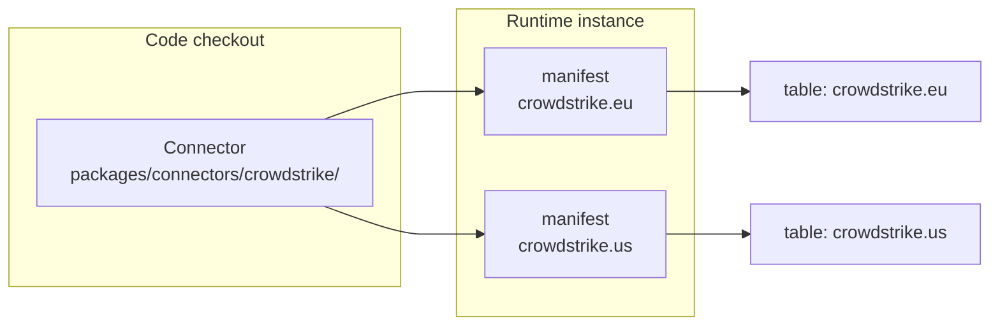

# Connector Model

A connector reads one type of source and normalises what it finds into a Prism schema. This document describes the connector model and the manifest that turns connector code into a running instance.

## Code against instance

The distinction is the centre of the model, and the current documents blur it.

| | What it is | Where it lives |
|---|---|---|
| **Connector** | The code that knows how to read one type of source. It is a library. | `packages/connectors/<type>/` in the code checkout |
| **Connector manifest** | One configured instance of that connector: which system, which credentials, which schema. | `.connectors/<type>.<instance>/manifest.json` in the runtime instance |

**One connector is driven by many manifests.** You have one CrowdStrike connector. If you have three CrowdStrike tenants, you write three manifests. You do not copy the connector.

The **collector** is the runnable entry point of a connector — the thing an operator starts to perform a collection. The connector is the component; the collector is what runs.

## The manifest

A manifest has six fields.

| Field | What it holds |
|---|---|
| `connectorType` | Which connector runs this instance |
| `instance` | The label that distinguishes this instance from others of the same type |
| `schema` | The asset schema this instance produces, such as `AssetComputer` |
| `credentials` | A map of logical name to credential **reference** |
| `config` | Settings for this instance that are not secret |
| `description` | Optional free text |

### The naming rule

`connectorType` and `instance` accept letters, digits and hyphens. **They reject dots.**

The reason is the identifier they combine into. A manifest feeds a table named `connectorType.instance` — `crowdstrike.eu` in the diagram above. A dot inside either segment would make that identifier ambiguous, so Prism refuses it at validation rather than producing a table nobody can address.

### Credentials are references, never values

**A manifest never holds a credential.** Each entry in `credentials` maps a logical name to an environment variable reference, in the form `env:VARIABLE_NAME`.

Prism validates this. An entry that is not an `env:` reference is rejected when the manifest loads — not warned about, rejected.

This is a designed guarantee, and it has a practical consequence: **a manifest is safe to commit to version control.** It records which variable supplies each credential, and nothing more. The values live in the runtime instance's environment file, which is not committed.

When you document or discuss a connector, name the variables. Never write a value, and never write a placeholder shaped like a real one.

## From collection to a table

A collector runs, reads its source, and produces a snapshot.

1. The collector loads its manifest and the environment for that instance.
2. It reads the source system, using the credentials the manifest references.
3. It normalises each record to the schema the manifest names.
4. It validates each record against that schema.
5. It builds a snapshot and transmits it to the instance's inbox.

**The first transmit registers the table.** You do not create a table by hand before a connector can use it. The connector's first successful transmit self-registers `connectorType.instance` in the table registry, and the sync engine can then target it.

That registration is also why a rule pointing at a table no source has ever transmitted to fails with an unknown-table error. The table does not exist yet.

## What a connector does not do

A connector does not merge. It does not resolve conflicts, it does not decide priority, and it does not write to the synthetic dataset. It collects, normalises and transmits.

The one exception is write-back, where a connector drains the outbox and writes to its own source. Even there the connector does not decide *what* to write — the engine decided that. The connector performs the write, because it is the only component with connectivity and credentials for that source. See [Sync engine](/docs/prism/architecture/sync-engine).

This separation is what makes connectors a public extension surface. A connector needs the connector SDK. It does not need the engine.

## Where to go next

| Question | Document |
|---|---|
| How do I build one? | [Writing a connector](/docs/prism/architecture/writing-a-connector) |
| Which connectors ship with Prism? | [Connectors](/docs/prism/architecture/connectors/) |
| What schema should it produce? | [Data model](/docs/prism/architecture/data-model) |
| What happens after the snapshot arrives? | [Sync engine](/docs/prism/architecture/sync-engine) |
