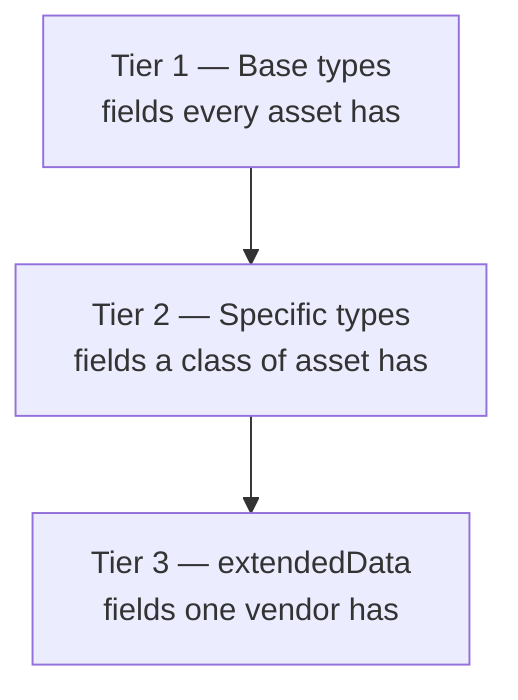

# Data Model

Prism normalises asset data from every source into one schema hierarchy. This document describes the hierarchy and tells you where a given field belongs.

## Why the model has tiers

Asset data from different sources shares some fields and not others.

- Every asset has an identifier, a name and a discovery time.
- A server has a processor count and a memory size. A network switch has ports and VLANs.
- One vendor sends fields no other vendor sends.

A single flat schema cannot hold all three without becoming either too loose to query or too rigid to accept real data. Prism therefore uses three tiers.



## Tier 1: base types

Three base types exist.

### BaseAsset

The foundation of every asset schema.

**Required fields**

| Field | What it holds |
|---|---|
| `id` | The unique identifier, from the source or generated |
| `name` | The name a person reads |
| `type` | The asset type |
| `discoveredAt` | When the source observed the asset |
| `source` | Which source the record came from |
| `schemaVersion` | The schema version of this record |

**Optional fields:** `description`, `tags`, `location`, `ownership`.

### BaseSystem

A logical group of assets, such as an application, a service or a network.

Its two significant fields are `components`, which lists asset identifiers, and `relationships`, which links the system to other systems.

### BaseFlow

A network flow or a data transfer between two assets.

Its significant fields are `source`, `destination`, `protocol` and `metadata`.

## Tier 2: specific types

A specific type extends `BaseAsset` with the fields its class of asset needs. Prism ships three.

### AssetComputer

Servers, virtual machines, workstations and containers.

It adds the operating system and its version, the processor count, the memory size, the storage size, the network interfaces, the run status, the host name, the fully-qualified domain name, and whether the machine is physical, virtual or a container.

### AssetNetwork

Switches, routers, firewalls and load balancers.

It adds the IP address, the subnet, the VLAN, the device type, the vendor, the model, the firmware version, the port count, the bandwidth and the connected devices.

### AssetControlDevice

Industrial control equipment: programmable logic controllers, remote terminal units, human-machine interfaces and supervisory systems.

It adds the vendor, the model, the firmware version, the serial number, the device class, the industrial protocols it speaks, the process it serves, and its certifications and safety rating.

## Tier 3: extendedData

Every specific type carries an `extendedData` object. It holds the fields that belong to one vendor and to no schema.

### The placement rule

Prism applies one rule, and you can predict it.

**A field that the schema recognises goes to its schema position. Every other field goes to `extendedData`.**

Worked example. A spreadsheet row arrives with these columns:

```
id, name, type, owner, awsInstanceType, awsAmi
```

The connector recognises `id`, `name`, `type` and `owner`. It maps each to its schema position. It does not recognise `awsInstanceType` or `awsAmi`, so both go to `extendedData`:

```json
{
  "id": "srv-001",
  "name": "web-server-01",
  "type": "computer",
  "ownership": { "owner": "Platform team" },
  "extendedData": {
    "awsInstanceType": "t3.large",
    "awsAmi": "ami-00000000"
  }
}
```

The rule is mechanical. A connector does not decide field by field.

### What belongs in extendedData

**Put a field here when** it belongs to one vendor, when you do not query or filter on it, or when it is an identifier that only the source understands.

**Do not put a field here when** you need to query or filter on it, or when more than one source sends it. Both cases mean the field should be in the schema instead. Ask for it.

**Never put sensitive data here.** `extendedData` is stored and displayed like any other field. It is not masked.

## Schema versions

Every record stores its own `schemaVersion`. Snapshots are immutable, so a record keeps the version it was written with.

A schema can gain an optional field without breaking the records already stored. A schema that changes structure needs a migration.

The registry of schemas and their versions is `packages/connector-sdk/src/schemas/metadata.ts`, which is part of the public connector SDK.

Upgrading between schema versions, and what happens to existing snapshots when a version advances, are covered in the [upgrade documentation](/docs/prism/upgrade/schema-migration).

## Where a snapshot is stored

Prism names a snapshot collection after its source: `snapshots_` followed by the source identifier.

A source identifier is lowercase, and uses hyphens between words. The connectors Prism ships use `azure-vms`, `crowdstrike`, `cylance`, `jira-assets`, `spreadsheet`, `ad-computers`, `local-host-python` and `local-host-powershell`. A connector you build chooses its own identifier and follows the same rule.

## Where to go next

| Question | Document |
|---|---|
| How does the engine merge these records? | [Sync engine](/docs/prism/architecture/sync-engine) |
| How does a connector produce them? | [Connector model](/docs/prism/architecture/connector-model) |
| How do I add a field the schema does not have? | [Writing a connector](/docs/prism/architecture/writing-a-connector) |
