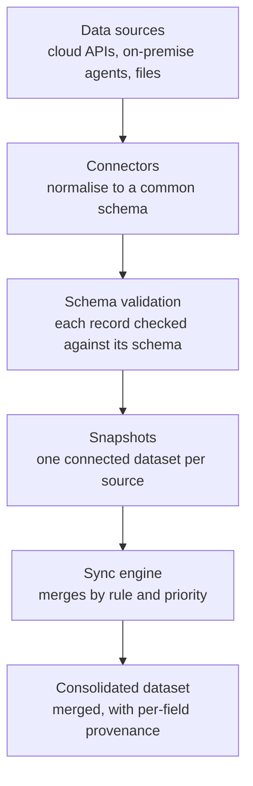
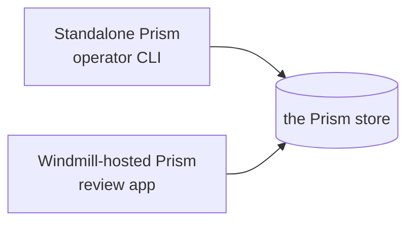

Sightline Prism collects asset data from many sources, normalises it to a common schema, and merges it into one consolidated view. This document describes the pipeline, the two hostings you can run it in, and where the work happens.

## The pipeline

Prism moves data through six stages.

1. **Data sources.** A source is a cloud API, an on-premise agent, or a file. Prism does not change the source.
2. **Connectors.** A connector reads one type of source and normalises each record to a Prism schema.
3. **Schema validation.** Prism validates every record before it stores the record. An invalid record does not enter the pipeline silently.
4. **Snapshots.** Prism stores each collection as a snapshot in a connected dataset. One source has one connected dataset. A connected dataset is read-only to the sync engine.
5. **Sync engine.** The engine applies your sync rules. It matches records across sources, resolves conflicts by priority, and produces a changeset.
6. **Consolidated dataset.** The merged result. Each field records its source, its priority and its timestamp, so you can audit every value.

The pipeline is not one program. Stages 1 to 4 run wherever the source is reachable. Stages 5 and 6 run centrally.

## One product, two hostings

Prism is one product. There are two ways to run it, and they differ in where the product runs, not in what it does.

| Hosting | Where it runs | What the operator uses |
|---|---|---|
| **Standalone Prism** | Your own machines, as one or more nodes | The operator CLI, in a terminal |
| **Windmill-hosted Prism** | A Windmill workspace | The review app, in a browser |

Both hostings run the same engine, the same connectors and the same rules. A decision an operator records in one is the same decision, with the same effect, in the other.

### Standalone does not mean one machine

A standalone deployment is already more than one node.

- `--role collector` installs a node that collects near a source.
- `--role central` installs a node that runs the sync engine and the review TUI.
- `prism-drain` runs where the source system is reachable, which is often neither of them.

Standalone means that Windmill does not host the product. It says nothing about the size of the deployment.

### The two hostings are not exclusive

A customer who chooses Windmill keeps the terminal. The operator CLI reads and writes an ordinary Prism store, and a Windmill-hosted store is an ordinary Prism store. An operator runs `prism-migrate-rules` against a Windmill deployment from a laptop, and the workspace shows the result.

Choose a hosting for where your operator works. Do not choose it for what the product can do.

### How the code is arranged

The product is built from three repositories. This is a build-time fact, and an installed copy of Prism needs none of them.

| Repository | What it holds |
|---|---|
| `sightline-prism` | The sync engine, the connector SDK and the connectors |
| `sightline-prism-cli` | The operator CLI |
| `sightline-prism-windmill` | The Windmill layer: the collector scripts and the review app |

The operator CLI and the Windmill layer each compile the engine and the connector SDK into their own release artifact. That is what lets an install carry no source and reach no registry. The `CONTRIBUTING.md` file in the source repository covers building them.

A connector you write against the connector SDK runs under either hosting.

## Where Prism runs

Prism separates the code from the deployment. The distinction causes more confusion than any other part of the product, so learn it before you run a command.

| Term | What it is |
|---|---|
| **install directory** | Where `install.mjs` and the archive sit. The installer reads this. Operational commands do **not** run from here. |
| **runtime instance** | A directory created by `node install.mjs --dir <path>`. It holds the environment file, the data directory, the connector manifests and the rule instances. Operational commands run from here. |

You can create more than one runtime instance from one install directory. Each instance has its own configuration and its own data.

If you run an operational command anywhere but the instance, it does not find the environment file or the data directory. The failure does not name the cause.

A contributor working from a `sightline-prism` **code checkout** meets the same rule: the checkout holds code, and it is never where a command runs.

## Storage backends

Prism stores data in one of three backends. The `STORAGE_BACKEND` environment variable selects the backend.

| Backend | Value | Notes |
|---|---|---|
| MongoDB | `mongo` | The default. Needs a connection URI and a database name. |
| PostgreSQL | `postgres` | One table per collection, created on first write. Safe for more than one process. |
| Local JSON store | `local` | One file per collection, in the instance data directory. Single-process. |

Every connector, the sync engine and the operator CLI work against any of them. No code changes.

**The backends do not share data.** A runtime instance that you move from the local store to MongoDB starts empty. Its collected data stays in the local store, and Prism does not migrate it for you. Decide the backend before you collect data you want to keep.

Windmill-hosted Prism uses MongoDB or PostgreSQL, never the local store. A local-store instance on a workstation does not carry over to it.

## Where to go next

| Question | Document |
|---|---|
| What shape is the data? | [Data model](/docs/prism/architecture/data-model) |
| How does the engine decide what to merge? | [Sync engine](/docs/prism/architecture/sync-engine) |
| What is a connector, and what is a manifest? | [Connector model](/docs/prism/architecture/connector-model) |
| How do I build a connector? | [Writing a connector](/docs/prism/architecture/writing-a-connector) |
| Which sources are supported? | [Connectors](/docs/prism/architecture/connectors/) |
| What is the operator CLI? | [The operator CLI](/docs/prism/architecture/cli) |
| What does Windmill hosting add? | [Windmill-hosted Prism](/docs/prism/architecture/windmill) |
