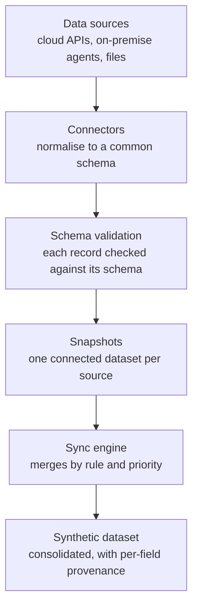
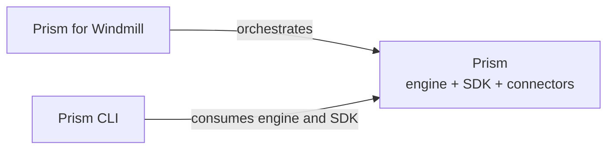

Sightline Prism collects asset data from many sources, normalises it to a common schema, and merges it into one consolidated view. This document describes the pipeline, the three products that make it up, and where each one runs.

## The pipeline

Prism moves data through six stages.

1. **Data sources.** A source is a cloud API, an on-premise agent, or a file. Prism does not change the source.
2. **Connectors.** A connector reads one type of source and normalises each record to a Prism schema.
3. **Schema validation.** Prism validates every record before it stores the record. An invalid record does not enter the pipeline silently.
4. **Snapshots.** Prism stores each collection as a snapshot in a connected dataset. One source has one connected dataset. A connected dataset is read-only to the sync engine.
5. **Sync engine.** The engine applies your sync rules. It matches records across sources, resolves conflicts by priority, and produces a changeset.
6. **Synthetic dataset.** The merged result. Each field records its source, its priority and its timestamp, so you can audit every value.

The pipeline is not one program. Stages 1 to 4 run wherever the source is reachable. Stages 5 and 6 run centrally.

## The three products

| Product | What it does |
|---|---|
| **Prism** | The engine, the connector SDK and the connectors. It performs the collection and the merge. |
| **Prism CLI** | The operator console. It runs syncs, and it presents changesets for review in a terminal. |
| **Prism for Windmill** | The orchestration and browser layer. It schedules collections and presents the same review operations in a browser. |

The three depend on each other in one direction only.

Prism CLI and Prism for Windmill both build against the engine and the connector SDK from a Prism checkout beside them, and both ship that code compiled into their own release artifact — so an installed copy of either needs no Prism checkout of its own. Prism for Windmill deploys Prism connectors and calls the same engine.

Prism itself has no dependency on either. A connector you build against the connector SDK runs without the CLI and without Windmill.

## Where Prism runs

Prism separates the code from the deployment. The distinction causes more confusion than any other part of the product, so learn it before you run a command.

| Term | What it is |
|---|---|
| **code checkout** | A clone of one of the three repositories. Code lives here. Operational commands do **not** run from here. |
| **runtime instance** | A directory created by `install/install.sh --dir <path>`. It holds the environment file, the data directory, the connector manifests and the rule instances. Operational commands run from here. |

You can create more than one runtime instance from one code checkout. Each instance has its own configuration and its own data.

If you run an operational command in the code checkout, it does not find the environment file or the data directory. The failure does not name the cause.

## Storage backends

Prism stores data in one of two backends. The `STORAGE_BACKEND` environment variable selects the backend.

| Backend | Value | Notes |
|---|---|---|
| MongoDB | `mongo` | The default. Needs a connection URI and a database name. |
| Local JSON store | `local` | One file per collection, in the instance data directory. Single-process. |

Every connector, the sync engine and the CLI work against either backend. No code changes.

**The two backends do not share data.** A runtime instance that you move from the local store to MongoDB starts empty. Its collected data stays in the local store, and Prism does not migrate it for you. Decide the backend before you collect data you want to keep.

The Windmill deployment always uses MongoDB. A local-store instance on a workstation does not carry over to it.

## Where to go next

| Question | Document |
|---|---|
| What shape is the data? | [Data model](/docs/prism/architecture/data-model) |
| How does the engine decide what to merge? | [Sync engine](/docs/prism/architecture/sync-engine) |
| What is a connector, and what is a manifest? | [Connector model](/docs/prism/architecture/connector-model) |
| How do I build a connector? | [Writing a connector](/docs/prism/architecture/writing-a-connector) |
| Which sources are supported? | [Connectors](/docs/prism/architecture/connectors/) |
| What is the CLI? | [Operator CLI](/docs/prism/architecture/cli) |
| What does the Windmill layer add? | [Windmill layer](/docs/prism/architecture/windmill) |
