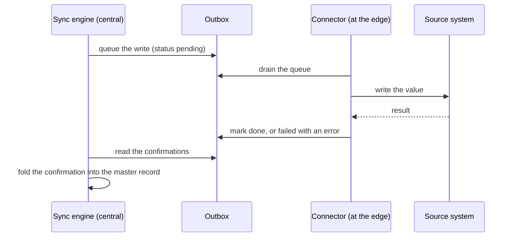

The sync engine merges records from your connected datasets into one synthetic dataset. This document describes what the engine does and what it guarantees. It does not describe how the engine is built.

Read this when you need to explain a result: why two records merged, why they did not, or why a value you expected did not change.

## What a sync rule does

A sync rule names a source, a target, and the fields to map between them. When you run a rule, the engine produces a **changeset**: a list of proposed changes, each one either applied immediately or held for a person to decide.

The engine never edits your source systems during a sync. A sync reads.

## Identity: how records match

Before the engine can merge two records, it must decide they describe the same thing.

### The matching order

The engine tries a **cross-reference** first. Once a source record has been reconciled to a master record, Prism remembers that source's native identifier. A later collection from the same source matches on that identifier directly.

When no cross-reference exists, the engine falls back to **natural keys**.

### The three natural keys

| Key | Normalised how |
|---|---|
| Serial number | Trimmed, then uppercased |
| MAC address | Reduced to twelve hexadecimal characters, separators removed |
| Host name | Lowercased, and the domain stripped to leave the short name |

Prism normalises before it compares, so `AA:BB:CC:11:22:33` and `aabbcc112233` are the same MAC address.

### The ranking, and why it matters

**The keys rank: serial number, then MAC address, then host name.**

The engine decides the match on **the highest-ranked key that both records carry**. It does not consult the lower-ranked keys afterwards.

This has a consequence you must understand:

> **A conflict on the deciding key prevents the match outright.** Two records with different serial numbers do not match, whatever their host names say.

That rule is what stops two different machines merging because someone named them both `server01`.

A match on serial number or MAC address is **strong**. A match on host name alone is **weak**, and the engine uses a weak match only when no strong match is available.

Two records that share no comparable key type cannot be reconciled at all. If one record has only a serial number and the other has only a host name, the engine has nothing to compare.

### Why a match you expected did not happen

Two causes account for most of them.

**A placeholder serial number.** Many machines report a serial number that the manufacturer never set — values such as `system serial number`, `default string`, `to be filled by o.e.m.` and `not specified`. Prism discards these before matching, exactly as if the field were empty. Two machines reporting the same placeholder therefore do not merge on it. This is deliberate: without the rule, every unconfigured machine in your estate would merge into one record.

**A MAC address that is not usable.** An address that does not reduce to twelve hexadecimal characters, or that is all zeroes, is discarded the same way.

### Records the engine cannot place

A source record with no native identifier and no natural keys is **skipped with a warning**. The engine cannot reconcile it and cannot tell it apart from a duplicate, so it does not guess. The rest of the collection proceeds.

## Merging: how a value is chosen

When a record matches a master, the engine compares each mapped field.

An identical value produces no change. A different value produces a proposed change, which carries the old value, the new value, the source, and a priority.

### Priority

Every field on a master record remembers the priority and the source of the value it currently holds. When a new value arrives, the engine compares priorities.

- A higher-priority incoming value replaces the existing one.
- A lower-priority incoming value is **shadowed**. It is recorded in the changeset, with a reason naming the existing source and both priorities, but it does not change the master.
- On an exact tie, the existing value is kept by default. A rule can set its tie-break to prefer the newer value instead.

Shadowing is not a failure. It is the engine telling you that a lower-trust source tried to overwrite a higher-trust one.

### Staleness

A source that stops reporting an asset should not hold a field hostage forever.

When the source that owns a field's value stops reporting the asset, the engine starts a grace period. **Within the grace period the value keeps its priority** — a source that misses one collection has not become untrustworthy. Once the source has been missing for longer than the grace period, the field's priority is demoted below any source still reporting, so a fresh value from a lower-priority source wins.

The default grace period is 24 hours. A rule can set its own.

### Presence

The engine tracks which sources still report each asset.

- A source that reported an asset before and does not report it now produces a presence change.
- A source that reports an asset again after it went missing produces a re-appearance change, and the asset reactivates.
- An asset can be active, a decommission candidate, or decommissioned, derived from what its sources report.

Presence reconciliation is on by default. Turn it off per rule for a source that reports only part of your estate, because a partial inventory would otherwise look like a set of disappearances.

## Applying: what happens automatically

Each proposed change carries a mode.

| Mode | What happens |
|---|---|
| `auto` | The engine applies the change immediately, if priority permits. |
| `review` | The change waits for a person. |

A changeset is `applied` when nothing is left pending, and `partial` when review items remain.

### New assets wait for a person

**A source record that matches no master does not create a master by default.** The engine raises it as a new-asset item, and a person approves it, links it to an existing master, or rejects it.

This is the safe default, and it is deliberate. Automatic creation on every unmatched record turns one mis-configured key mapping into thousands of duplicate masters. A rule can opt into automatic creation where you know the source is authoritative.

### A change has one of eight outcomes

`pending`, `applied`, `shadowed`, `approved`, `rejected`, `rolled_back`, `superseded`, `linked`.

`superseded` deserves a note: when a rule runs again and a review item from the previous run is still waiting, the engine retires the old item rather than presenting you the same decision twice.

## Provenance: why you can audit a value

Every field in a synthetic dataset records the source that supplied it, the priority that source held, and when it was last updated.

This is the property that makes a merge auditable. For any value in the consolidated view, you can answer: where did this come from, why did it win, and when.

## Write-back: sending a value out

The engine has no connectivity to your sources. It cannot write to CrowdStrike or Jira, and it holds no credentials for them.

Write-back therefore uses an **outbox**. The engine queues the intended write. The connector for that source — which does have connectivity and credentials — drains the queue, performs the write, and reports back.

**Nothing is recorded as written until the connector confirms it.** A queued item is `pending`, `done` or `failed`, and carries an attempt count and, on failure, the error.

Two kinds of write-back exist. A **write** updates a field on a record that already exists in the source. A **create** provisions a new record in the source, and returns the identifier the source assigned, which the engine stores as a cross-reference.

### Direction is not a property of the rule

A rule does not declare whether it merges inward or writes outward. **The engine decides from where the target lives.** A rule whose target is a remote table produces write-backs; a rule whose target is a local dataset produces a merge. An operator runs both through the same command.

## Designed behaviour you may mistake for a fault

| What you see | What it means |
|---|---|
| The run fails with an unknown-table error | The rule's target is not registered. The engine refuses rather than defaulting to a merge, because a silent default would write to the wrong place. A connector registers its table on first transmit; a local table is seeded. |
| The run reports no changeset at all | The source has no snapshot yet. Collect first. This is not an error. |
| Older data never appears | A merge reads **the most recent snapshot only**, not the accumulated history. Snapshots are kept for audit, not replayed on every sync. |
| One field is missing from a changeset, and there is a warning | The value failed validation against the target schema. The engine rejects that field and applies the rest of the changeset. |
| The rule will not run | The rule is disabled. |
| A record was skipped, and there is a warning | The record had no identifier the engine could use. See *Records the engine cannot place*. |

## Where to go next

| Question | Document |
|---|---|
| What shape are the records? | [Data model](/docs/prism/architecture/data-model) |
| How do I run a sync and review the result? | [Running a sync](/docs/prism/usage/sync) |
| How do I write and edit rules? | [Managing rules](/docs/prism/usage/manage-rules) |
| How do I run a write-back? | [Write-back](/docs/prism/usage/write-back) |
