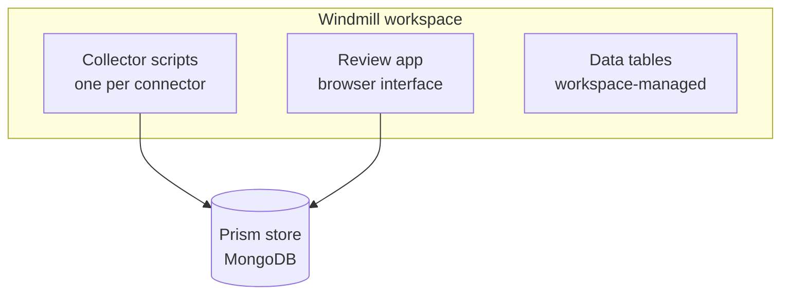

Windmill-hosted Prism schedules the collections and presents the review operations in a browser. It deploys into a Windmill workspace from a repository of its own, `sightline-prism-windmill`.

It adds orchestration and a browser interface. It does not add a second engine. It calls the same one, deploys the same connectors, and records the same decisions as a terminal does.

This is one of the two hostings of a single product, not a second product. [Architecture overview](/docs/prism/architecture/overview) covers the pair. Choosing it does not take the operator CLI away: the CLI reads and writes a Windmill-hosted store like any other.

## What it is made of

| Part | What it does |
|---|---|
| Collector scripts | Run a connector on a Windmill schedule instead of by hand |
| Review app | Presents changesets, datasets and rules in a browser |
| Data tables | Workspace-managed tables the review app reads |

The workspace tree lives under `f/`. The review app is at `f/prism/review_app__raw_app`, with its compiled output, its backend and the SQL it applies to the workspace tables.

## It carries its own compiled copy of the engine

An install needs **no `sightline-prism` checkout**. The sync engine, the connector SDK, the shared review logic and four connectors — CrowdStrike, Cylance, Azure VMs and Jira Assets — ship inside the release tarball as compiled bundles under `vendor/`, and every script imports them from there. The deployment configuration names `./vendor` as its only code base, so nothing resolves outside the install directory.

Cutting a release is the one step that still needs the sibling checkout: `scripts/release.sh` builds `vendor/` from it and aborts if it is absent. Using a release does not.

Two bundles, because the runtimes differ. The backend scripts load `vendor/prism-core.js`, built for Node. The review app runs in a browser and loads `vendor/prism-browser.js`, which is self-contained — it cannot use the Node bundle, whose database client initialises at module load and drags Node-only modules into a browser build.

## Deployment

The layer deploys with `wmill sync`, against the configuration in `wmill.yaml`.

Two things about that configuration are worth knowing before you deploy.

**Secrets are never tracked as files.** Workspace variables are pushed directly by the setup script and are deliberately excluded from the synchronised files. A `wmill sync` does not carry your credentials, in either direction.

**Resources are synchronised; resource types and secrets are not.** That split is intentional. It lets you version the shape of your deployment without versioning what is in it.

## It requires a shared backend

**Windmill-hosted Prism uses MongoDB or PostgreSQL.** Its storage resource names one of the two and carries that backend's connection details. The local JSON store is a single-process backend, intended for a workstation and for a single operator. It is not an option here.

If you tried Prism on a workstation with the local store, that data does not carry over. The backends do not share data. See [Overview](/docs/prism/architecture/overview) for the backends Prism supports.

## The review app and the review TUI

The review app presents the same six operations as the terminal interface of the operator CLI: reviewing pending changes, browsing changesets, browsing a dataset's records, re-running a rule, managing deferrals, and managing rules.

They are not two products with different capabilities. They are two front ends over one engine. Choose by where your operator is.

The review app adds two entries the terminal has no equivalent for. Both exist to cover a source whose connector cannot run, and [the review app](/docs/prism/usage/review-app) describes them.

The procedures are written once, in the usage documentation: [Reviewing changesets](/docs/prism/usage/review-changesets) and [the review app](/docs/prism/usage/review-app).

## Where to go next

| Question | Document |
|---|---|
| How do I install it? | [Installing Windmill-hosted Prism](/docs/prism/install/windmill) |
| How do I upgrade it? | [Upgrading Windmill-hosted Prism](/docs/prism/upgrade/windmill) |
| How do I use the review app? | [Review app](/docs/prism/usage/review-app) |
| What does the engine do with what it collects? | [Sync engine](/docs/prism/architecture/sync-engine) |
