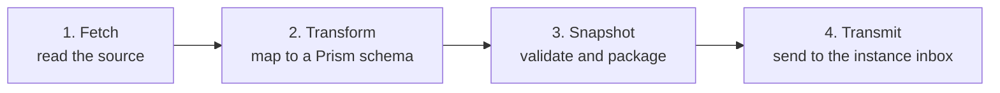

A connector reads one type of source and transmits normalised snapshots to Prism. This guide takes you from an empty directory to a transmitting collector.

## What you need, and what you do not

A connector depends on the **connector SDK**, `@sightline/prism-connector-sdk`. That is the whole dependency.

**A connector does not need the sync engine.** It does not link against it, call it, or require access to it. You can build a connector, run it against a Prism store, and never touch the engine. This is what makes connectors an extension surface rather than an internal detail.

## Connectors are language-agnostic

A connector is any program that can read your source and transmit a snapshot. Prism ships collectors in three languages, and you can add a fourth.

| Language | Suits | Shipped example |
|---|---|---|
| TypeScript | Cloud and vendor APIs, complex transforms | `packages/connectors/azure-vms/collect.ts` |
| Python | System agents, hosts without a Node runtime | `packages/connectors/local-host-python/collect.py` |
| PowerShell | Windows estates, domain-joined hosts | `packages/connectors/ad-computers/Collect-ADComputers.ps1` |

Pick the language that reaches your source most directly. A connector that runs on a domain controller is easier to write in PowerShell than to make work from anywhere else.

## The four steps every connector performs

Every shipped connector follows the same shape.



1. **Fetch.** Read the source, using the credentials your manifest references. Handle the source's paging here, not later.
2. **Transform.** Map each source record to a Prism schema. Recognised fields go to their schema positions; everything else goes to `extendedData`. See [Data model](/docs/prism/architecture/data-model) for the placement rule.
3. **Snapshot.** Validate every record against the schema and package the set as a snapshot. Validation happens before transmission, so an invalid record never enters the pipeline.
4. **Transmit.** Send the snapshot to the instance's inbox. The first transmit registers the table.

Note that step 4 is a transmit, not a database write. The connector does not know or care which storage backend is configured.

## Building one

### 1. Start from a shipped connector

Copy the closest example rather than starting empty. The examples are complete and current.

```bash
# TypeScript, from the code checkout
cp -r packages/connectors/azure-vms packages/connectors/my-source

# Python
cp -r packages/connectors/local-host-python packages/connectors/my-source
```

Choose the example by shape, not by vendor. A connector for any paged REST API resembles `azure-vms` more than it resembles `spreadsheet`.

### 2. Set the connector type

Your connector's type is its directory name. It must be lowercase, and may contain letters, digits and hyphens. It must not contain a dot — the dot separates the type from the instance in the derived table identifier.

### 3. Declare your credentials as references

A manifest names an environment variable for each credential. It never holds the value. See [Connector model](/docs/prism/architecture/connector-model).

Decide which variables your connector needs and document their names. Choose names that say which system they belong to.

### 4. Write the transform

This is the part that is genuinely yours. Everything else is pattern.

Map the source's fields to the schema you chose. For each source field, ask whether Prism's schema has a place for it. If yes, map it there. If no, put it in `extendedData`.

Resist the urge to invent schema fields. If a field is one you will query on, and more than one source supplies it, it belongs in the schema itself — ask for it rather than working around its absence.

### 5. Test against a mock first

Run the two mock connectors before you point yours at a live system. They need no credentials and exercise the whole pipeline, so a failure tells you whether your environment is wrong or your connector is.

### 6. Verify the transmit

Confirm the snapshot arrived and the table registered. Until the first transmit succeeds, no sync rule can target your connector — a rule pointing at an unregistered table fails rather than defaulting.

## Practices worth following

**Handle the source's paging.** A source that returns 100 records per page will silently give you 100 records and no error. Page until the source says it is done.

**Respect rate limits.** A collector that runs on a schedule and hammers a vendor API gets the credentials throttled or revoked. Back off on the response the vendor documents.

**Fail loudly on authentication, quietly on one bad record.** A wrong credential should stop the collection with a clear message. One malformed record among ten thousand should be skipped with a warning, not abort the run.

**Never log a credential.** Log the variable name, never its value, and check what your error handler prints when the source rejects your authentication.

## Where to go next

| Question | Document |
|---|---|
| What is a manifest, exactly? | [Connector model](/docs/prism/architecture/connector-model) |
| Which schema should I produce? | [Data model](/docs/prism/architecture/data-model) |
| What happens to my snapshot afterwards? | [Sync engine](/docs/prism/architecture/sync-engine) |
| How do I run my connector? | [Running a collector](/docs/prism/usage/collect) |
