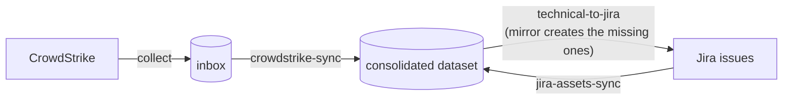

This page sets up one pipeline from end to end. Sightline Prism collects CrowdStrike endpoints into a consolidated dataset. It writes those records out to Jira as CMDB issues. It reads Jira back, so the two stay linked.

The page assembles the other install pages into one order. It adds what is specific to this pipeline, which is the three rule mappings. Where another page owns a step, this page links to it.

For a rehearsal that needs no credentials, use the synthetic fixture demo in the repository under `demo/`. It runs on a workstation with no CrowdStrike tenant and no Jira site.

## What you end up with



The round trip takes three rules.

| Rule | Direction | What it decides |
|---|---|---|
| `crowdstrike-sync` | CrowdStrike to the consolidated dataset | Which agent-reported fields land, and at what priority |
| `jira-assets-sync` | Jira to the consolidated dataset | Which CMDB fields land, and how far below CrowdStrike they sit |
| `technical-to-jira` | The consolidated dataset to Jira | Which merged values go back, and whether an unlinked host gets an issue |

The second and third rules make a loop rather than two one-way feeds. Jira's static entries arrive at a low priority. CrowdStrike's live values win. The winner then goes back out over Jira's stale copy.

## Before you start

Read [Prerequisites](/docs/prism/install/prerequisites). Then read [Installing Prism](/docs/prism/install/prism) and [The runtime instance](/docs/prism/install/runtime-instance).

Every command on this page runs from a runtime instance. It does not run from the code checkout. [The runtime instance](/docs/prism/install/runtime-instance) explains why, and this is the most common early mistake.

Arrange three things first:

- A PostgreSQL server that the collectors can reach.
- CrowdStrike API credentials with the read scopes the connector needs.
- A Jira project that you administer.

You create the Jira project, its issue type and its custom fields. Part 3 names the fields. The rest of the page assumes they exist.

---

## Part 1 — PostgreSQL

Read [Storage backends](/docs/prism/install/storage-backends) first. It is the authority on the variables and on what each backend costs you.

Set two variables for this pipeline:

```bash
export STORAGE_BACKEND=postgres
export POSTGRES_URI='postgresql://<user>:<password>@<host>:5432/<database>?sslmode=require'
```

Two things cause trouble here.

The `pg` driver is an optional dependency. Install it on any node that selects `postgres`:

```bash
npm install pg
```

A node that selects `postgres` without the driver stops at startup and says so.

A managed server refuses a connection that does not use TLS. The refusal does not mention TLS. It reports `no pg_hba.conf entry for host ...`, which reads as a firewall fault. The `sslmode=require` value above prevents it.

There is no schema to create. The engine creates each table on the first write to that collection.

Confirm the backend before you go on. Every command that touches storage names the backend in its startup log. [Storage backends](/docs/prism/install/storage-backends) covers how to verify it.

---

## Part 2 — CrowdStrike

The connector README is the authority on its configuration, its regional base URLs and its required API scopes. See [CrowdStrike Falcon Connector](/docs/prism/architecture/connectors/crowdstrike).

The connector reads its `.env` from its own folder. It does not read the repository root, and it does not read the runtime instance:

```
packages/connectors/crowdstrike/.env
```

```ini
CROWDSTRIKE_CLIENT_ID=...
CROWDSTRIKE_CLIENT_SECRET=...
# Must match your tenant's cloud. US-1 is the default. US-2, EU-1 and
# US-GOV-1 use their own hosts. The README lists them.
CROWDSTRIKE_BASE_URL=https://api.crowdstrike.com
```

### Name the instance

An instance name separates one deployment of a connector from another. The name becomes part of the source id that every rule references.

Choose the name now. Do not change it later. The rules, the inbox and the outbox all key on it.

This page uses `prod`, which gives the source id `crowdstrike.prod`.

```bash
mkdir -p .connectors/crowdstrike.prod
cat > .connectors/crowdstrike.prod/manifest.json <<'EOF'
{"connectorType": "crowdstrike", "instance": "prod", "schema": "AssetComputer", "credentials": {}, "config": {}}
EOF
```

### Run the first collection

[Run a collector](/docs/prism/usage/collect) covers the command. It also covers how to confirm that the snapshot landed.

Collect before you write any rule. A rule written against a guess at the field names costs you two debugging passes.

Then read one real record. The connector normalises a CrowdStrike host to `AssetComputer`. It puts vendor-specific values under `extendedData.crowdstrike*`, which holds most of the fields Part 4 maps.

---

## Part 3 — Jira

You set up Jira. Prism does not create a project, an issue type, a field or a scheme.

### 1. Create the project and the issue type

Create the project, or use an existing one. Choose the issue type that represents a machine. This page uses the project key `ASSET` and the issue type `Computer`.

### 2. Create the custom fields

The connector README carries the full table with each `fieldIds` key. See [Jira Assets Connector](/docs/prism/architecture/connectors/jira-assets) § Jira Setup.

This pipeline needs five text fields.

| Purpose | `fieldIds` key |
|---|---|
| Host name. Both directions match on it. | `hostName` |
| IP address | `ip` |
| MAC address | `mac` |
| Model | `model` |
| Asset ID. Holds the Prism master record id. | `assetId` |

Add each field to the project's screens. Jira accepts a field that is not on a screen, and then never shows it or returns it.

### 3. Read the field ids back

Jira assigns each `customfield_NNNNN` id itself. The numbers differ per site. You cannot choose them, so do not guess them.

```bash
curl -u you@example.com:$JIRA_API_TOKEN \
  https://your-domain.atlassian.net/rest/api/3/field \
  | jq '.[] | select(.custom) | {name, id}'
```

### 4. Put the ids in the manifest

Field ids are per-instance configuration. Set them in the connector manifest. The connector falls back to its own defaults for any id you do not override.

```bash
mkdir -p .connectors/jira-assets.prod
cat > .connectors/jira-assets.prod/manifest.json <<'EOF'
{
  "connectorType": "jira-assets",
  "instance": "prod",
  "schema": "BaseAsset",
  "credentials": {},
  "config": {
    "baseUrl": "https://your-domain.atlassian.net",
    "projectKey": "ASSET",
    "fieldIds": {
      "hostName": "customfield_10001",
      "ip":       "customfield_10002",
      "mac":      "customfield_10003",
      "model":    "customfield_10004",
      "assetId":  "customfield_10005"
    }
  }
}
EOF
```

Substitute your own ids. The ids above are examples and do not match your site.

Put the credentials in `packages/connectors/jira-assets/.env`. It holds `JIRA_URL`, `JIRA_EMAIL`, `JIRA_API_TOKEN` and `JIRA_PROJECT_KEY`.

This gives the source id `jira-assets.prod`.

---

## Part 4 — The three rules

This part is specific to your data. Work through it slowly.

[Create and edit rules](/docs/prism/usage/manage-rules) covers the editor. This page covers what to put in it.

### How the editor presents a rule

The editor has two modes, and a button switches between them.

**Visual** is a grid. Each row is one field mapping. The **Add mapping** button appends a row. The rule's id, name, source, target, target schema and enabled flag sit above the grid.

**Raw** is the rule as JSON in a Monaco editor. The editor parses the JSON as you type. It blocks the switch back to Visual while the JSON does not parse. It disables **Save** while any expression is invalid, and while any mapping has an empty source or target.

The grid columns follow the rule's direction.

| Direction | Columns |
|---|---|
| Sync, into the consolidated dataset | Source field, Target field, Mode, Priority, Expression, Condition |
| Reverse, out of the consolidated dataset | Master field, Source field, Expression, Condition |

A reverse rule shows no Mode and no Priority. It merges nothing. It writes one value to one place.

The target sets the direction. You do not choose it. A local target makes the rule merge. A remote source makes it push. The app asks only when the target is absent from the table registry. [The review app](/docs/prism/usage/review-app) and [Run a sync rule](/docs/prism/usage/sync) both cover this.

### The two ideas the mappings encode

**Priority decides which source wins a field.** Two sources can report the same target field. The engine applies the higher priority and shadows the lower one. It keeps the shadowed value and shows it. This is why the Jira rule sits below CrowdStrike.

**Mode decides whether a person sees the change.** A mapping set to `auto` applies during the sync. A mapping set to `review` waits for approval.

Reserve `review` for fields where a wrong value is expensive, such as security posture or business criticality. Every `review` mapping adds work for a person.

> An approval overrides priority. A person who approves a lower-priority proposal replaces a higher-priority applied value.

### 4a. CrowdStrike to the consolidated dataset

| Header field | Value |
|---|---|
| id | `crowdstrike-sync` |
| Source | `crowdstrike.prod` |
| Target | `consolidated-assets` |
| Target schema | `AssetComputer` |

The grid does not hold the identity keys or `sourceIdField`. Set them in **Raw**. They decide when two records describe the same machine.

```json
"sourceIdField": "id",
"identityKeys": { "hostname": "hostname", "mac": "network.0.macAddress" },
"reconcilePresence": false
```

Then add the mappings. The shipped `crowdstrike-sync.json` holds the full set to copy from.

| Source field | Target field | Mode | Priority |
|---|---|---|---|
| `hostname` | `hostname` | auto | 85 |
| `os` | `platform` | auto | 85 |
| `osVersion` | `osVersion` | auto | 90 |
| `network.0.ipAddress` | `localIpAddress` | auto | 80 |
| `network.0.macAddress` | `macAddress` | auto | 85 |
| `extendedData.crowdstrikeDeviceId` | `crowdstrikeDeviceId` | auto | 95 |
| `extendedData.crowdstrikeLastSeen` | `lastSeenDate` | auto | 95 |
| `extendedData.crowdstrikeSystemProductName` | `model` | auto | 85 |
| `extendedData.crowdstrikePreventionPolicy` | `preventionPolicy` | review | 95 |
| `extendedData.crowdstrikeDetectionState` | `detectionState` | review | 95 |

Note the shape of a source field. It uses dots, and it indexes an array by position, as in `network.0.ipAddress`. Vendor-specific values sit under `extendedData`.

`reconcilePresence` stays `false` here on purpose. Set it to `true` and the engine proposes a decommission for any host absent from a run. You want that behaviour later. You do not want it while you still confirm that the collector sees the whole fleet.

### 4b. Jira to the consolidated dataset

| Header field | Value |
|---|---|
| id | `jira-assets-sync` |
| Source | `jira-assets.prod` |
| Target | `consolidated-assets` |
| Target schema | `BaseAsset` |

```json
"sourceIdField": "id",
"identityKeys": { "hostname": "extendedData.hostname" },
"reconcilePresence": false
```

`extendedData.hostname` holds the Host Name field from Part 3. The match on it joins a Jira issue to the machine that CrowdStrike already reports. Without it, Jira creates a second master record.

| Source field | Target field | Mode | Priority | Why |
|---|---|---|---|---|
| `extendedData.hostname` | `hostname` | auto | 60 | The identity link |
| `extendedData.jiraIssueKey` | `jiraIssueKey` | auto | 90 | Addresses the write-back |
| `extendedData.jiraIpAddress` | `localIpAddress` | auto | 55 | Below CrowdStrike's 80. Shadowed on purpose. |
| `extendedData.jiraModel` | `model` | auto | 60 | Below CrowdStrike's 85 |
| `ownership.owner` | `owner` | auto | 75 | Jira is authoritative for ownership |

The asymmetry is deliberate. Jira wins on the business facts that only Jira holds. CrowdStrike wins on anything an agent observes live.

### 4c. The consolidated dataset to Jira

| Header field | Value |
|---|---|
| id | `technical-to-jira` |
| `masterDataset` | `consolidated-assets` |
| `targetSource` | `jira-assets.prod` |

⛔ `targetSource` must match the drain exactly. The queue is `outbox_<target source>`. The drain reads the queue named by the source string you give it. A mismatch drains an empty queue and reports success.

The grid maps a master field to a source field. The right column holds the Jira field ids from Part 3.

| Master field | Source field |
|---|---|
| `hostname` | `summary` |
| `hostname` | `customfield_10001` |
| `localIpAddress` | `customfield_10002` |
| `macAddress` | `customfield_10003` |
| `model` | `customfield_10004` |
| `masterId` | `customfield_10005` |

`hostname` appears twice on purpose. The first mapping writes the issue summary, so a person can read the issue. The second writes the Host Name field, so rule 4b can match on it next time.

**Mirror creates an issue for a machine that Jira does not hold.** Without mirror, this rule updates existing issues only. With mirror, a master record that holds no Jira link proposes a new issue.

```json
"mirror": {
  "mode": "review",
  "createFields": {
    "project":   { "key": "ASSET" },
    "issuetype": { "name": "Computer" }
  }
}
```

The value `review` puts every creation behind a person. The engine creates all fields for a host or none of them. It then writes the returned issue key into that master record's identity, and it never proposes the host again.

### Load the rules

The editor is one way to create a rule. To load rule files in bulk, see [Create and edit rules](/docs/prism/usage/manage-rules). The engine reads rules from storage, not from the JSON files. A file that you edit on disk changes nothing until you load it.

---

## Part 5 — Run the pipeline

### Inbound

1. Collect. See [Run a collector](/docs/prism/usage/collect).
2. Run `crowdstrike-sync`. See [Run a sync rule](/docs/prism/usage/sync).
3. Review the changeset. See [Review and apply changesets](/docs/prism/usage/review-changesets).
4. Repeat steps 1 to 3 for `jira-assets-sync`, once Jira holds issues to read.

On a first run, every host arrives as a new-asset proposal. The engine writes nothing to the consolidated dataset until a person approves it.

### Outbound

5. Run `technical-to-jira`. The rule queues the changes. It writes nothing to Jira. Every mirror-create proposal waits for approval.
6. Approve the changes that should go out.
7. Drain the queue. The drain calls the Jira API.

⛔ **Do not use the shipped `prism-drain` command here.** It is a reference implementation with a dry-run writer. It contacts nothing and it writes nothing. It still marks every item as done. Run it against a real outbox and it consumes the queue while the summary reports the items as written.

The Jira connector supplies its own authenticated writer. Use it:

```bash
npx tsx packages/connectors/jira-assets/writeback.ts
```

Check the source id before the first drain. That entry point drains the source `jira-assets`. This page gives the reverse rule the target source `jira-assets.prod`, so the queue is `outbox_jira-assets.prod`. The two do not match. Align them before you drain. Name the instance-less source in the rule, or drain the instance-qualified queue from your own entry point. A mismatch here fails silently.

## Confirm the loop

1. A Jira issue exists for a CrowdStrike host. It holds the hostname, the IP address and the MAC address.
2. The host's master record carries both sources. [Browse datasets and changesets](/docs/prism/usage/browse) shows the source and the priority for each field.
3. Change that host's IP address by hand in Jira. Run `jira-assets-sync`. The engine shadows the change. It does not apply it, because CrowdStrike outranks Jira on the IP address.
4. Run `technical-to-jira`. Drain the queue. Jira returns to the authoritative value.

Step 3 is the one to watch. If the engine applies the change instead of shadowing it, the priorities in 4a and 4b do not match this page.

## What this page does not cover

- **Running the pipeline from Windmill.** See [Installing the Windmill layer](/docs/prism/install/windmill). The rules and the mappings do not change. The review app drives them instead of the CLI.
- **Schedules.** Nothing above runs on a timer.
- **Decommissions.** Both sync rules set `reconcilePresence` to `false`. Turn it on once you trust the collector's coverage. Read what the outage guard does first.
- **A second endpoint source.** Add another rule shaped like 4a, with its own priorities.

## Where to go next

| Question | Document |
|---|---|
| How do I run this from Windmill? | [Installing the Windmill layer](/docs/prism/install/windmill) |
| What does each review decision mean? | [Review and apply changesets](/docs/prism/usage/review-changesets) |
| How does the engine decide a merge? | [Architecture overview](/docs/prism/architecture/overview) |
| How do I add another connector? | [Writing a connector](/docs/prism/architecture/writing-a-connector) |
