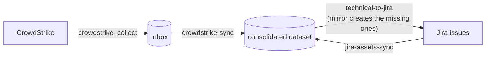

Sightline Prism collects CrowdStrike endpoints into a consolidated dataset. It writes those records out to Jira as CMDB issues, and it reads Jira back, so the two stay linked.

This recipe builds that loop on Windmill-hosted Prism over a PostgreSQL store.

## The four choices

Four decisions shape an install of Prism. This recipe has made all four.

| Choice | This recipe | Where another recipe changes it |
|---|---|---|
| Hosting | Windmill-hosted Prism | [Installing Standalone Prism](/docs/prism/install/prism) covers the other hosting |
| Storage backend | PostgreSQL | [Storage backends](/docs/prism/install/storage-backends) covers MongoDB. This hosting does not accept the local JSON store |
| Endpoint source | CrowdStrike Falcon | Cylance and Azure VMs ship in the same connector catalog. See [Installing Windmill-hosted Prism](/docs/prism/install/windmill) |
| System of record | Jira | [Writing a connector](/docs/prism/architecture/writing-a-connector) covers a target that Prism does not already ship |

The recipe also fixes one name. Every source id below uses the instance `prod`, which gives `crowdstrike.prod` and `jira-assets.prod`.

Each part follows one row. Part 1 follows the storage backend, Part 2 the endpoint source, and Part 3 the system of record. Part 4 sets the priorities between the last two. The hosting decides the commands in Part 1 and Part 5.

## What you end up with



The round trip takes three rules.

| Rule | Direction | What it decides |
|---|---|---|
| `crowdstrike-sync` | CrowdStrike to the consolidated dataset | Which agent-reported fields land, and at what priority |
| `jira-assets-sync` | Jira to the consolidated dataset | Which CMDB fields land, and how far below CrowdStrike they sit |
| `technical-to-jira` | The consolidated dataset to Jira | Which merged values go back, and whether an unlinked host gets an issue |

The second and third rules make a loop rather than two one-way feeds. Jira's static entries arrive at a low priority. CrowdStrike's live values win, and the winner then goes back out over Jira's stale copy.

## Before you start

Read [Prerequisites](/docs/prism/install/prerequisites), then [Installing Windmill-hosted Prism](/docs/prism/install/windmill).

The installer runs from its own directory, beside the archive it reads. Every `wmill` command below runs from the install directory that `--dir` names. That directory holds `wmill.yaml`, which is where the `wmill` CLI reads its workspace binding.

Arrange four things first:

- A Windmill workspace, registered with your `wmill` CLI.
- A PostgreSQL server that the Windmill workers can reach.
- CrowdStrike API credentials with the read scopes the connector needs.
- A Jira project that you administer.

You create the Jira project, its issue type and its custom fields before you run the installer. Part 3 names the fields.

---

## Part 1 — PostgreSQL

One command installs the layer. It asks for the storage backend, then for each connector's credentials in turn.

```bash
node install.mjs --dir ./acme-prism-windmill --connectors crowdstrike,jira-assets
```

Answer `postgres` at the backend prompt. The installer then asks only for that backend's values, which [Installing Windmill-hosted Prism](/docs/prism/install/windmill) lists in full. It writes the resource to `f/prism/storage` and stores the password as a Windmill secret variable.

Two things cause trouble here.

**Leave `sslmode` at `require`.** A managed server refuses a connection that does not use TLS, and the refusal does not mention TLS. It reports `no pg_hba.conf entry for host ...`, which reads as a firewall fault.

**The workers reach the server, not your workstation.** A Windmill Cloud worker connects from the public internet, so a firewalled server must allow its egress. A worker that cannot get through reports `connect ETIMEDOUT`, not a credentials error.

There is no schema to create. The engine creates each table on the first write to that collection.

The install carries the `pg` driver. The `npm install pg` step in [Storage backends](/docs/prism/install/storage-backends) applies to a standalone node, not to this hosting.

---

## Part 2 — CrowdStrike

Read [CrowdStrike Falcon Connector](/docs/prism/architecture/connectors/crowdstrike) for the regional base URL your tenant needs and the API scopes to grant.

The same installer run asks for three values.

| Prompt | What it holds |
|---|---|
| `clientId` | The API client id |
| `clientSecret` | The API client secret. The prompt is masked, and the value becomes a Windmill secret variable |
| `baseUrl` | Your tenant's cloud. US-1 is offered as the default. US-2, EU-1 and US-GOV-1 use their own hosts, and the connector README lists them |

The installer writes the resource to `f/prism/crowdstrike_credentials` and copies the collector script to `f/prism/crowdstrike_collect.ts`.

### Name the instance

An instance name separates one deployment of a connector from another. The name becomes part of the source id that every rule references.

In this hosting the instance is an argument to the collector script. There is no manifest file to write, and no `.connectors` directory.

Choose the name now. Do not change it later, because the rules, the inbox and the outbox all key on it. This recipe uses `prod`, which gives the source id `crowdstrike.prod`.

### Run the first collection

Collect before you write any rule. A rule written against a guess at the field names costs you two debugging passes. Part 5 carries the command.

Then read one real record. The connector normalises a CrowdStrike host to `AssetComputer`. It puts vendor-specific values under `extendedData.crowdstrike*`, which holds most of the fields Part 4 maps.

---

## Part 3 — Jira

You set up Jira. Prism does not create a project, an issue type, a field or a scheme.

### 1. Create the project and the issue type

Create the project, or use an existing one. Choose the issue type that represents a machine. This recipe uses the project key `ASSET` and the issue type `Computer`.

### 2. Create the custom fields

The connector README carries the full table with each `fieldIds` key. See [Jira Assets Connector](/docs/prism/architecture/connectors/jira-assets) § Jira Setup.

This pipeline needs six text fields.

| Purpose | `fieldIds` key |
|---|---|
| Host name. Both directions match on it. | `hostName` |
| IP address | `ip` |
| MAC address | `mac` |
| Model | `model` |
| Owner. Jira is authoritative for it, and rule 4b maps it. | `owner` |
| Asset ID. Holds the Prism master record id. | `assetId` |

Add each field to the project's screens. Jira accepts a field that is not on a screen, and then never shows it or returns it.

### 3. Read the field ids back

Jira assigns each `customfield_NNNNN` id itself. The numbers differ per site. You cannot choose them, so do not guess them.

```bash
curl -u you@example.com:$JIRA_API_TOKEN \
  https://your-domain.atlassian.net/rest/api/3/field \
  | jq '.[] | select(.custom) | {name, id}'
```

### 4. Answer the Jira credential prompts

The installer asks for four values, and writes them to `f/prism/jira-assets_credentials`.

| Prompt | What it holds |
|---|---|
| `url` | `https://your-domain.atlassian.net` |
| `email` | The account the API token belongs to |
| `apiToken` | The API token. The prompt is masked, and the value becomes a Windmill secret variable |
| `projectKey` | `ASSET` |

This gives the source id `jira-assets.prod`.

### 5. Put the field ids in the collector script

The Windmill collector script builds the connector manifest itself, from the credentials resource. It sets the base URL and the project key, and it sets no field ids.

Open `f/prism/jira-assets_collect.ts` in your install directory. Add a `fieldIds` map to the manifest config:

```ts
const manifest = {
  connectorType: 'jira-assets',
  instance,
  schema: 'BaseAsset',
  credentials: {},
  config: {
    baseUrl: jira_credentials.url,
    projectKey: jira_credentials.projectKey || 'ASSET',
    fieldIds: {
      hostName: 'customfield_10001',
      ip:       'customfield_10002',
      mac:      'customfield_10003',
      model:    'customfield_10004',
      assetId:  'customfield_10005',
    },
  },
};
```

Substitute your own ids. The ids above are examples and do not match your site.

⛔ `hostName` has no default, and neither does `mac`. The connector's built-in ids cover the other keys. Rule 4b matches a Jira issue to a machine on `extendedData.hostname`, which is the `hostName` field. Without this override, every Jira issue creates a second master record beside the CrowdStrike one.

A later installer run does not disturb this edit. The installer skips a connector whose credentials resource file is already present. Deleting `f/prism/jira-assets_credentials.resource.yaml` to redo the credentials copies the template back over your edit.

### 6. Deploy

The installer ends with a preview. Read it, then push.

```bash
cd acme-prism-windmill
wmill sync push
```

Confirm the push landed:

```bash
wmill sync push --dry-run
```

**Expected output.** No remaining changes. A second preview that still lists the same scripts and resources means the push did not complete.

---

## Part 4 — The three rules

This part is specific to your data. Work through it slowly.

Open the review app in your Windmill workspace and choose **Manage rules**. [Create and edit rules](/docs/prism/usage/manage-rules) covers the editor. This part covers what to put in it.

### Where the rules live

This hosting keeps rules in the `rules` collection in your store. There is no `rules` directory and no file to load, so the editor is how a rule gets in and how it changes.

### How the editor presents a rule

The editor has two modes, and a button switches between them.

**Visual** is a grid. Each row is one field mapping. The **Add mapping** button appends a row. The rule's id, name, source, target, target schema and enabled flag sit above the grid.

**Raw** is the rule as JSON in a Monaco editor. The editor parses the JSON as you type. It blocks the switch back to Visual while the JSON does not parse. It disables **Save** while any expression is invalid, and while any mapping has an empty source or target.

The grid columns follow the rule's direction.

| Direction | Columns |
|---|---|
| Sync, into the consolidated dataset | Source field, Target field, Mode, Priority, Expression, Condition |
| Reverse, out of the consolidated dataset | Master field, Source field, Expression, Condition |

A reverse rule shows no Mode and no Priority. It merges nothing. It writes one value to one place.

The target sets the direction. You do not choose it. A local target makes the rule merge. A remote source makes it push. The app asks only when the target is absent from the table registry. [The review app](/docs/prism/usage/review-app) and [Run a sync rule](/docs/prism/usage/sync) both cover this.

### The two ideas the mappings encode

**Priority decides which source wins a field.** Two sources can report the same target field. The engine applies the higher priority and shadows the lower one. It keeps the shadowed value and shows it. This is why the Jira rule sits below CrowdStrike.

**Mode decides whether a person sees the change.** A mapping set to `auto` applies during the sync. A mapping set to `review` waits for approval.

Reserve `review` for fields where a wrong value is expensive, such as security posture or business criticality. Every `review` mapping adds work for a person.

> An approval overrides priority. A person who approves a lower-priority proposal replaces a higher-priority applied value.

### 4a. CrowdStrike to the consolidated dataset

| Header field | Value |
|---|---|
| id | `crowdstrike-sync` |
| Source | `crowdstrike.prod` |
| Target | `consolidated-assets` |
| Target schema | `AssetComputer` |

The grid does not hold the identity keys or `sourceIdField`. Set them in **Raw**. They decide when two records describe the same machine.

```json
"sourceIdField": "id",
"identityKeys": { "hostname": "hostname", "mac": "network.0.macAddress" },
"reconcilePresence": false,
"tieBreak": "newer"
```

⛔ `tieBreak` is not optional here, although the schema treats it as optional. A field already holds a CrowdStrike value at priority 85. CrowdStrike reports a new value for it, also at priority 85. That is an exact tie, and the default resolves a tie by keeping what is there. The update is shadowed, and **CrowdStrike can never revise its own reading**. The value `newer` lets the incoming value win a tie, which is what an agent-reported field needs. A tie between two different sources cannot arise here, because no two mappings give the same target field the same priority.

Then add the mappings.

| Source field | Target field | Mode | Priority |
|---|---|---|---|
| `hostname` | `hostname` | auto | 85 |
| `os` | `platform` | auto | 85 |
| `osVersion` | `osVersion` | auto | 90 |
| `network.0.ipAddress` | `localIpAddress` | auto | 80 |
| `network.0.macAddress` | `macAddress` | auto | 85 |
| `extendedData.crowdstrikeDeviceId` | `crowdstrikeDeviceId` | auto | 95 |
| `extendedData.crowdstrikeLastSeen` | `lastSeenDate` | auto | 95 |
| `extendedData.crowdstrikeSystemProductName` | `model` | auto | 85 |
| `extendedData.crowdstrikePreventionPolicy` | `preventionPolicy` | review | 95 |
| `extendedData.crowdstrikeDetectionState` | `detectionState` | review | 95 |

Note the shape of a source field. It uses dots, and it indexes an array by position, as in `network.0.ipAddress`. Vendor-specific values sit under `extendedData`.

`reconcilePresence` stays `false` here on purpose. Set it to `true` and the engine proposes a decommission for any host absent from a run. You want that behaviour later. You do not want it while you still confirm that the collector sees the whole fleet.

### 4b. Jira to the consolidated dataset

| Header field | Value |
|---|---|
| id | `jira-assets-sync` |
| Source | `jira-assets.prod` |
| Target | `consolidated-assets` |
| Target schema | `BaseAsset` |

```json
"sourceIdField": "extendedData.jiraIssueKey",
"identityKeys": { "hostname": "extendedData.hostname" },
"reconcilePresence": false,
"tieBreak": "newer"
```

⛔ `sourceIdField` must be `extendedData.jiraIssueKey`, not `id`. The value it names becomes the native id in the master's cross-reference, and rule 4c addresses its write-back by that native id. The Jira collector sets `id` to the Asset ID field. It falls back to the issue key only while that field is empty. So `id` is the issue key until the first write-back populates Asset ID, and the Prism master record id from then on. A rule that keys on `id` therefore works, pushes once, and then addresses every later write to an issue key that does not exist. Naming the issue key directly does not move.

`tieBreak` is set for the same reason as [rule 4a](#4a-crowdstrike-to-the-consolidated-dataset): without it Jira cannot revise a field it already owns, such as the owner.

`extendedData.hostname` holds the Host Name field from Part 3. The match on it joins a Jira issue to the machine that CrowdStrike already reports. Without it, Jira creates a second master record.

| Source field | Target field | Mode | Priority | Why |
|---|---|---|---|---|
| `extendedData.hostname` | `hostname` | auto | 60 | The identity link |
| `extendedData.jiraIssueKey` | `jiraIssueKey` | auto | 90 | Addresses the write-back |
| `extendedData.jiraIpAddress` | `localIpAddress` | auto | 55 | Below CrowdStrike's 80. Shadowed on purpose. |
| `extendedData.jiraModel` | `model` | auto | 60 | Below CrowdStrike's 85 |
| `ownership.owner` | `owner` | auto | 75 | Jira is authoritative for ownership |

The asymmetry is deliberate. Jira wins on the business facts that only Jira holds. CrowdStrike wins on anything an agent observes live.

### 4c. The consolidated dataset to Jira

| Header field | Value |
|---|---|
| id | `technical-to-jira` |
| `masterDataset` | `consolidated-assets` |
| `targetSource` | `jira-assets.prod` |

⛔ `targetSource` must carry the instance. The queue is `outbox_<target source>`, and the write-back script in Part 5 drains `jira-assets.<instance>` for the instance you pass it. Name the source `jira-assets` here and the two do not meet: the drain reads an empty queue and reports success.

The grid maps a master field to a source field. The right column holds the Jira field ids from Part 3.

| Master field | Source field |
|---|---|
| `hostname` | `summary` |
| `hostname` | `customfield_10001` |
| `localIpAddress` | `customfield_10002` |
| `macAddress` | `customfield_10003` |
| `model` | `customfield_10004` |
| `masterId` | `customfield_10005` |

`hostname` appears twice on purpose. The first mapping writes the issue summary, so a person can read the issue. The second writes the Host Name field, so rule 4b can match on it next time.

**Mirror creates an issue for a machine that Jira does not hold.** Without mirror, this rule updates existing issues only. With mirror, a master record that holds no Jira link proposes a new issue.

```json
"mirror": {
  "mode": "review",
  "createFields": {
    "project":   { "key": "ASSET" },
    "issuetype": { "name": "Computer" }
  }
}
```

The value `review` puts every creation behind a person. The engine creates all fields for a host or none of them. It then writes the returned issue key into that master record's identity, and it never proposes the host again.

---

## Part 5 — Run the pipeline

The collectors and the write-back are deployed Windmill scripts. Run one with the `wmill` CLI, or from **Run a script** in the review app. The rules and the reviews run in the review app.

### Inbound

1. Collect from CrowdStrike.

   ```bash
   wmill script run f/prism/crowdstrike_collect --data '{
     "crowdstrike_credentials": "$res:f/prism/crowdstrike_credentials",
     "storage": "$res:f/prism/storage",
     "instance": "prod"
   }'
   ```

   **Expected output.** A completed job returning `success: true` with the instance you named. [Run a collector](/docs/prism/usage/collect) covers how to confirm that the snapshot landed.

2. Run `crowdstrike-sync` from **Re-run a sync rule**. See [Run a sync rule](/docs/prism/usage/sync).
3. Review the changeset in **Review pending changes**. See [Review and apply changesets](/docs/prism/usage/review-changesets).
4. Repeat steps 1 to 3 for `f/prism/jira-assets_collect` and `jira-assets-sync`, once Jira holds issues to read. The Jira script takes `jira_credentials`, bound to `$res:f/prism/jira-assets_credentials`.

On a first run, every host arrives as a new-asset proposal. The engine writes nothing to the consolidated dataset until a person approves it.

### Outbound

5. Run `technical-to-jira` from **Re-run a sync rule**. The rule queues the changes and writes nothing to Jira. Every mirror-create proposal waits for approval.
6. Approve the changes that should go out.
7. Drain the queue. The write-back script calls the Jira API.

   ```bash
   wmill script run f/prism/jira-assets_writeback --data '{
     "jira_credentials": "$res:f/prism/jira-assets_credentials",
     "storage": "$res:f/prism/storage",
     "instance": "prod"
   }'
   ```

⛔ Pass the collector and the write-back the same instance. Each script resolves the source id `jira-assets.<instance>` on its own. A write-back given a different instance drains an empty queue and reports success.

The review app offers a second route for a source no script can reach. **Complete a source's pending write-backs** lists the queued items, downloads them, and records the ones you performed by hand. See [Run a write-back](/docs/prism/usage/write-back).

## Confirm the loop

1. A Jira issue exists for a CrowdStrike host. It holds the hostname, the IP address and the MAC address.
2. The host's master record carries both sources. [Browse datasets and changesets](/docs/prism/usage/browse) shows the source and the priority for each field.
3. Change that host's IP address by hand in Jira. Run `jira-assets-sync`. The engine shadows the change. It does not apply it, because CrowdStrike outranks Jira on the IP address.
4. Run `technical-to-jira`. Drain the queue. Jira returns to the authoritative value.

Step 3 is the one to watch. If the engine applies the change instead of shadowing it, the priorities in 4a and 4b do not match this recipe.

## After the first loop

- **Put the collectors on a schedule.** Nothing above runs on a timer. Windmill schedules a deployed script, and the two collector scripts are what to schedule.
- **Turn on decommissions.** Both sync rules set `reconcilePresence` to `false`. Turn it on once you trust the collector's coverage. See [rule 4a](#4a-crowdstrike-to-the-consolidated-dataset) for what the setting does.
- **Add a second endpoint source.** Install its connector, then add a rule shaped like 4a with its own priorities.

## Where to go next

| Question | Document |
|---|---|
| What does each review decision mean? | [Review and apply changesets](/docs/prism/usage/review-changesets) |
| How does the engine decide a merge? | [Architecture overview](/docs/prism/architecture/overview) |
| What else is in the review app? | [The review app](/docs/prism/usage/review-app) |
| How do I add another connector? | [Writing a connector](/docs/prism/architecture/writing-a-connector) |
