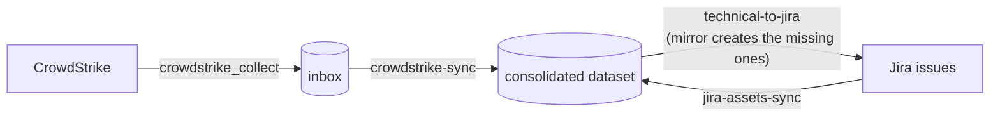

Sightline Prism collects CrowdStrike endpoints into a consolidated dataset. It writes those records out to Jira as CMDB issues, and it reads Jira back, so the two stay linked.

This recipe builds that loop on Windmill-hosted Prism over a PostgreSQL store.

## The four choices

Four decisions shape an install of Prism. This recipe has made all four.

| Choice | This recipe |
|---|---|
| Hosting | Windmill-hosted Prism |
| Storage backend | PostgreSQL |
| Endpoint source | CrowdStrike Falcon |
| System of record | Jira |

The recipe also fixes one name. Every source id below uses the instance `prod`, which gives `crowdstrike.prod` and `jira-assets.prod`.

Parts 1 to 3 follow one row of the table each, and they run at a terminal. Parts 4 to 7 run in the review app, which is where the field mapping, the collections, the rules and the reviews happen.

## What you end up with



The round trip takes three rules.

| Rule | Direction | What it decides |
|---|---|---|
| `crowdstrike-sync` | CrowdStrike to the consolidated dataset | Which agent-reported fields land, and at what priority |
| `jira-assets-sync` | Jira to the consolidated dataset | Which CMDB fields land, and how far below CrowdStrike they sit |
| `technical-to-jira` | The consolidated dataset to Jira | Which merged values go back, and whether an unlinked host gets an issue |

The second and third rules make a loop rather than two one-way feeds. Jira's static entries arrive at a low priority. CrowdStrike's live values win, and the winner then goes back out over Jira's stale copy.

## Before you start

Read [Prerequisites](/docs/prism/install/prerequisites), then [Installing Windmill-hosted Prism](/docs/prism/install/windmill).

The installer runs from its own directory, beside the archive it reads. Every `wmill` command below runs from the install directory that `--dir` names. That directory holds `wmill.yaml`, which is where the `wmill` CLI reads its workspace binding.

Arrange four things first:

- A Windmill workspace, registered with your `wmill` CLI.
- A PostgreSQL server that the Windmill workers can reach.
- CrowdStrike API credentials with the read scopes the connector needs.
- A Jira project that you administer.

You create the Jira project, its issue type and its custom fields before you run the installer. Part 3 names the fields.

---

## Part 1 — PostgreSQL

One command installs the layer. It asks for the storage backend first. Then, for each connector, it asks for an instance name, the credentials and the settings.

```bash
node install.mjs --dir ./acme-prism-windmill --connectors crowdstrike,jira-assets
```

Answer `postgres` at the backend prompt. The installer then asks only for that backend's values, which [Installing Windmill-hosted Prism](/docs/prism/install/windmill) lists in full. It writes the resource to `f/prism/storage` and stores the password as a Windmill secret variable.

Two things cause trouble here.

**Leave `sslmode` at `require`.** A managed server refuses a connection that does not use TLS, and the refusal does not mention TLS. It reports `no pg_hba.conf entry for host ...`, which reads as a firewall fault.

**The workers reach the server, not your workstation.** A Windmill Cloud worker connects from the public internet, so a firewalled server must allow its egress. A worker that cannot get through reports `connect ETIMEDOUT`, not a credentials error.

There is no schema to create. The engine creates each table on the first write to that collection.

The install carries the `pg` driver. The `npm install pg` step in [Storage backends](/docs/prism/install/storage-backends) applies to a standalone node, not to this hosting.

---

## Part 2 — CrowdStrike

Read [CrowdStrike Falcon Connector](/docs/prism/architecture/connectors/crowdstrike) for the regional base URL your tenant needs and the API scopes to grant.

The same installer run asks for four values.

| Prompt | What it holds |
|---|---|
| `instance` | Names this deployment of the connector. Defaults to `prod` |
| `clientId` | The API client id |
| `clientSecret` | The API client secret. The prompt is masked, and the value becomes a Windmill secret variable |
| `baseUrl` | Your tenant's cloud. US-1 is offered as the default. US-2, EU-1 and US-GOV-1 use their own hosts, and the connector README lists them |

The installer writes one resource, `f/prism/crowdstrike_prod_manifest`, and copies the collector script to `f/prism/crowdstrike_collect.ts`.

### The manifest is the instance

That resource holds the whole deployment: which connector it is, the instance name, the credentials it authenticates with, and the settings it collects by. A secret is stored as a pointer to a Windmill variable, never as text.

The instance name separates one deployment of a connector from another, and it becomes part of the source id that every rule references.

Choose the name at the prompt. Do not change it later, because the rules, the inbox and the outbox all key on it. This recipe uses `prod`, which gives the source id `crowdstrike.prod`.

To add a second CrowdStrike tenant later, duplicate the manifest resource in Windmill and change `instance`. There is nothing else to create.

---

## Part 3 — Jira

You set up Jira. Prism does not create a project, an issue type, a field or a scheme.

### 1. Create the project and the issue type

Create the project, or use an existing one. Choose the issue type that represents a machine. This recipe uses the project key `ASSET` and the issue type `Computer`.

### 2. Create the custom fields

The connector README carries the full table with each key. See [Jira Assets Connector](/docs/prism/architecture/connectors/jira-assets) § Jira Setup.

This pipeline needs six text fields.

| Purpose | The key you map it to |
|---|---|
| Host name. Both directions match on it. | `hostName` |
| IP address | `ip` |
| MAC address | `mac` |
| Model | `model` |
| Owner. Jira is authoritative for it, and rule 6b maps it. | `owner` |
| Asset ID. Holds the Prism master record id. | `assetId` |

Add each field to the project's screens. Jira accepts a field that is not on a screen, and then never shows it or returns it.

You do not need the `customfield_NNNNN` id of any of them. Part 4 reads the ids from your own site and lists them for you.

### 3. Answer the Jira prompts

The same installer run asks for five values.

| Prompt | What it holds |
|---|---|
| `instance` | Names this deployment. Defaults to `prod`, which gives the source id `jira-assets.prod` |
| `email` | The account the API token belongs to |
| `apiToken` | The API token. The prompt is masked, and the value becomes a Windmill secret variable |
| `baseUrl` | `https://your-domain.atlassian.net` |
| `projectKey` | `ASSET` |

It writes `f/prism/jira-assets_prod_manifest`, and it copies two scripts. `f/prism/jira-assets_collect.ts` collects. `f/prism/jira-assets_discover.ts` reads your field ids in Part 4.

---

## Deploy the workspace

The installer ends with a preview. Read it, then push.

```bash
cd acme-prism-windmill
wmill sync push
```

Confirm the push landed:

```bash
wmill sync push --dry-run
```

**Expected output.** No remaining changes. A second preview that still lists the same scripts and resources means the push did not complete.

Everything below runs in the review app. Open it in your Windmill workspace.

---

## Part 4 — Read what each instance collects

Choose **Connectors**. Both instances are listed, and both read `never read`.

Every connector reports what it collects, and **Refresh fields** is how you ask. What comes back differs, because the two connectors know their fields in different ways.

| Instance | What a refresh does | What you get |
|---|---|---|
| `crowdstrike.prod` | Reads the shape the connector declares. It contacts CrowdStrike for nothing and returns at once | The list of paths a rule can name |
| `jira-assets.prod` | Asks your Jira site for its custom fields | A mapping table, because your site numbers its own fields |

Refresh both. An instance that has never been refreshed cannot collect: until then nothing says which fields that connector needs.

### 1. Read the CrowdStrike fields

Choose **Configure** on `crowdstrike.prod`, then **Refresh fields**.

**Expected output.** A table headed **What this instance collects**. Each row is a path, what it holds, and its type. Part 6 writes rules against these names, so leave the tab open.

There is nothing to map here. CrowdStrike returns one record shape, and the connector already knows it. The instance reads `ready` once it has been refreshed.

A later release of the connector can collect a new path. Refreshing after an upgrade is how that reaches you, which is why the button is offered for this connector too.

### 2. Read the Jira fields

Choose **Back to connectors**, then **Configure** on `jira-assets.prod`. Choose **Refresh fields**. The app asks your Jira site for its custom fields and records the answer on the manifest.

**Expected output.** The line above the buttons names when the fields were read and how many were found. A mapping table appears below it.

A failure here is a credential or a base URL problem. The message names the Jira endpoint it called.

### 3. Map the Jira fields

The table holds one row per key the connector understands. The dropdown on each row lists every custom field your site returned, with its name, its id and its type.

Map the six fields from Part 3.

| Collects | Choose the field you created for |
|---|---|
| `hostName` | Host name |
| `assetId` | Asset ID |
| `ip` | IP address |
| `mac` | MAC address |
| `model` | Model |
| `owner` | Owner |

Leave every other row at `(not collected)`.

⛔ `hostName` is required, and **Collect now** stays disabled until it is mapped. Rule 6b matches a Jira issue to a machine on the value it holds. Without it, every Jira issue creates a second master record beside the CrowdStrike one.

Choose **Save mapping**. It writes the ids to the manifest's `config.fieldIds` and touches nothing else, so a later refresh cannot disturb them.

### 4. Copy the ids

Rule 6c addresses Jira by field id, so copy the `customfield_NNNNN` id of each field you mapped. The dropdown shows the id beside the name.

### When a Jira field changes

Add a field in Jira, then choose **Refresh fields** again. The new field joins the dropdowns, and the saved mapping is untouched.

Delete a field in Jira, and its row is flagged `orphaned` after the next refresh. The app keeps the mapping and asks you to decide it. An orphan can also mean the refresh saw only part of the catalogue, so check Jira before you clear one.

---

## Part 5 — The first collection

Collect from the connectors before you write the rule. This allows you to browse for field names in the rule builder.

### 1. Collect from Jira

You are on the `jira-assets.prod` page. Choose **Collect now**.

The app runs the collector against this manifest. It supplies the storage resource itself, so there is nothing to fill in.

**Expected output.** A line confirming the collection and naming the source id.

### 2. Collect from CrowdStrike

Choose **Back to connectors**. Choose **Configure** on `crowdstrike.prod`, then **Collect now**. Part 4 refreshed this instance, so it is ready.

### 3. Confirm both landed

Choose **Browse data**, then **Inboxes**.

**Expected output.** One row per source, with the number of snapshots, when the latest was taken, and how many records it holds. Open a row to read the records themselves.

⛔ **A source missing from this list did not land.** A collector reports success even where the transmit is skipped, and it logs the reason as a warning. Read that run's job log in Windmill.

Then read one real CrowdStrike record. Part 4 named the paths; this shows the values in them. The connector normalises a CrowdStrike host to `AssetComputer`, and puts vendor-specific values under `extendedData.crowdstrike*`.

---

## Part 6 — The three rules

This part is specific to your data. Work through it slowly.

Choose **Rules**. [Create and edit rules](/docs/prism/usage/manage-rules) covers the editor. This part covers what to put in it.

### Where the rules live

This hosting keeps rules in the `rules` collection in your store. There is no `rules` directory and no file to load, so the editor is how a rule gets in and how it changes.

### Where the consolidated dataset comes from

A connector's dataset registers itself the first time that connector collects. `consolidated-assets` belongs to no connector, so nothing registers it that way. The installer declares it as a `prism_local_table` resource in your workspace.

A declaration is not yet a dataset. The engine reads its own table registry from the store, not from Windmill, and it refuses a rule whose target that registry does not hold. Two things reconcile the declarations into it, and both are steps you were taking anyway:

- Opening **Rules**. The screen reads the dataset list, and that read reconciles first.
- Running a rule from **Re-run**. It reconciles before the rule starts.

So a declared dataset is ready by the time you can name it in a rule. Nothing has to be run by hand, and re-running either costs nothing: the reconcile writes only what the declarations say and repeats safely.

**To add a second consolidated dataset**, duplicate `f/prism/consolidated_assets_table` in Windmill and change its `id`. Open **Rules** once afterwards, which is where the new id joins the dataset lists.

**To declare one while writing a rule**, name a merge target that nothing declares yet. The editor says so and offers to declare it, which creates the resource and registers it in one step.

### How the editor presents a rule

The editor has two modes, and a button switches between them.

**Visual** is a grid. Each row is one field mapping. The **Add mapping** button appends a row. The rule's id, name, source, target, target schema and enabled flag sit above the grid.

**Raw** is the rule as JSON in a Monaco editor. It is where the settings with no control live, such as `reconcilePresence`, `newAssetMode` and `presenceGuard`. The editor parses the JSON as you type. It blocks the switch back to Visual while the JSON does not parse. It disables **Save** while any expression is invalid, and while any mapping has an empty source or target.

The grid columns follow the rule's direction.

| Direction | Columns |
|---|---|
| Sync, into the consolidated dataset | Source field, Target field, Mode, Priority, Expression, Condition |
| Reverse, out of the consolidated dataset | Master field, Source field, Expression, Condition |

A reverse rule shows no Mode and no Priority. It merges nothing. It writes one value to one place.

The target sets the direction. A local target makes the rule merge, and a remote source makes it push. The app asks only when the target is absent from the table registry. [The review app](/docs/prism/usage/review-app) and [Run a sync rule](/docs/prism/usage/sync) both cover how the target sets the rule's direction.

### The two ideas the mappings encode

**Priority decides which source wins a field.** Two sources can report the same target field. The engine applies the higher priority and shadows the lower one. It keeps the shadowed value and shows it. This is why the Jira rule sits below CrowdStrike.

**Mode decides whether a person sees the change.** A mapping set to `auto` applies during the sync. A mapping set to `review` waits for approval.

Reserve `review` for fields where a wrong value is expensive, such as security posture or business criticality. Every `review` mapping adds work for a person.

> An approval overrides priority. A person who approves a lower-priority proposal replaces a higher-priority applied value.

### 6a. CrowdStrike to the consolidated dataset

| Header field | Value |
|---|---|
| id | `crowdstrike-sync` |
| Source | `crowdstrike.prod` |
| Target | `consolidated-assets` |
| Target schema | `AssetComputer` |

Fill in the **Identity** panel above the grid. It decides when two records describe the same machine. A rule that gets it wrong still runs, and writes a new master record for every host.

| Identity field | Value |
|---|---|
| This source's own id | `id` |
| Master field `hostname` matches | `hostname` |
| Master field `mac` matches | `network.0.macAddress` |
| When two values tie on priority | `newer` |

`reconcilePresence` has no control. Set it in Raw, where it defaults to absent:

```json
"reconcilePresence": false
```

⛔ The tie-break is not optional here, although the rule schema treats it as optional. A field already holds a CrowdStrike value at priority 85. CrowdStrike reports a new value for it, also at priority 85. That is an exact tie, and the default resolves a tie by keeping what is there. The update is shadowed, and CrowdStrike can never revise its own reading. The value `newer` lets the incoming value win a tie, which is what an agent-reported field needs. A tie between two different sources cannot arise here, because no two mappings give the same target field the same priority.

Then add the mappings.

| Source field | Target field | Mode | Priority |
|---|---|---|---|
| `hostname` | `hostname` | auto | 85 |
| `os` | `platform` | auto | 85 |
| `osVersion` | `osVersion` | auto | 90 |
| `network.0.ipAddress` | `localIpAddress` | auto | 80 |
| `network.0.macAddress` | `macAddress` | auto | 85 |
| `extendedData.crowdstrikeDeviceId` | `crowdstrikeDeviceId` | auto | 95 |
| `extendedData.crowdstrikeLastSeen` | `lastSeenDate` | auto | 95 |
| `extendedData.crowdstrikeSystemProductName` | `model` | auto | 85 |
| `extendedData.crowdstrikePreventionPolicy` | `preventionPolicy` | review | 95 |
| `extendedData.crowdstrikeDetectionState` | `detectionState` | review | 95 |

Note the shape of a source field. It uses dots, and it indexes an array by position, as in `network.0.ipAddress`. Vendor-specific values sit under `extendedData`. Every one of them is in the list Part 4 returned for this instance.

⛔ Two paths in that list are not on every record. `network.1.ipAddress` exists only where the host reports an external address, and `extendedData.crowdstrikePreventionPolicy` only where a prevention policy is assigned. A mapping for either is correct and applies to the hosts that carry it.

`reconcilePresence` stays `false` while you are still confirming that the collector sees the whole fleet. Set it to `true` and the engine proposes a decommission for any host absent from a run.

### 6b. Jira to the consolidated dataset

| Header field | Value |
|---|---|
| id | `jira-assets-sync` |
| Source | `jira-assets.prod` |
| Target | `consolidated-assets` |
| Target schema | `BaseAsset` |

Fill in the **Identity** panel again.

| Identity field | Value |
|---|---|
| This source's own id | `extendedData.jiraIssueKey` |
| Master field `hostname` matches | `extendedData.hostname` |
| When two values tie on priority | `newer` |

```json
"reconcilePresence": false
```

⛔ The source's own id must be `extendedData.jiraIssueKey`, not `id`. The value it names becomes the native id in the master's cross-reference, and rule 6c addresses its write-back by that native id. The Jira collector sets `id` to the Asset ID field. It falls back to the issue key only while that field is empty. So `id` is the issue key until the first write-back populates Asset ID, and the Prism master record id from then on. A rule that keys on `id` therefore works, pushes once, and then addresses every later write to an issue key that does not exist. Naming the issue key directly does not move.

The tie-break is `newer` for the reason [rule 6a](#6a-crowdstrike-to-the-consolidated-dataset) gives. Left on `keep`, Jira cannot revise a field it already owns, such as the owner.

`extendedData.hostname` holds whatever field you mapped to `hostName` in Part 4. The match on it joins a Jira issue to the machine that CrowdStrike already reports.

| Source field | Target field | Mode | Priority | Why |
|---|---|---|---|---|
| `extendedData.hostname` | `hostname` | auto | 60 | The identity link |
| `extendedData.jiraIssueKey` | `jiraIssueKey` | auto | 90 | Addresses the write-back |
| `extendedData.jiraIpAddress` | `localIpAddress` | auto | 55 | Below CrowdStrike's 80. Shadowed on purpose. |
| `extendedData.jiraModel` | `model` | auto | 60 | Below CrowdStrike's 85 |
| `ownership.owner` | `owner` | auto | 75 | Jira is authoritative for ownership |

The asymmetry is deliberate. Jira wins on the business facts that only Jira holds. CrowdStrike wins on anything an agent observes live.

### 6c. The consolidated dataset to Jira

| Header field | Value |
|---|---|
| id | `technical-to-jira` |
| `masterDataset` | `consolidated-assets` |
| `targetSource` | `jira-assets.prod` |

⛔ `targetSource` must carry the instance. The queue is `outbox_<target source>`, and **Write back now** drains the source id its manifest names. Name the source `jira-assets` here and the two do not meet: the write-back reads an empty queue and reports success.

The grid maps a master field to a source field. The right column holds the Jira field ids you copied in Part 4.

| Master field | Source field |
|---|---|
| `hostname` | `summary` |
| `hostname` | `customfield_10001` |
| `localIpAddress` | `customfield_10002` |
| `macAddress` | `customfield_10003` |
| `model` | `customfield_10004` |
| `masterId` | `customfield_10005` |

Substitute your own ids. The ids above are examples and do not match your site.

`hostname` appears twice on purpose. The first mapping writes the issue summary, so a person can read the issue. The second writes the Host Name field, so rule 6b can match on it next time.

### What happens to a machine Jira does not hold

A push writes to an issue that already exists. It finds that issue by the key rule 6b recorded on the master record. A master with no Jira key therefore has no address, and this rule skips that machine silently on every run.

The **Missing records** panel is where you decide that. Tick **Create a record when the target has none**.

| Control | This recipe |
|---|---|
| Before creating a record | `review` |
| Fields every new record is created with | `{"project": {"key": "ASSET"}, "issuetype": {"name": "Computer"}}` |

**`review` puts every creation behind a person.** Choose it for the first runs. A creation is not reversible from the review screen: once approved, the issue exists in Jira, and rejecting it later does not remove it. A first run proposes one issue for every unlinked machine at once, which is the moment to have a person read the list.

**The create fields are what Jira needs before it accepts a new issue at all.** Jira refuses a new issue that names no project and no issue type, and Prism can infer neither, so the rule carries them. They apply to every issue this rule creates. The grid's field mappings are written on top of them: `summary` and the custom fields come from the master record, `project` and `issuetype` from here.

Another target system needs its own fields. The panel takes any JSON object, and what belongs in it is whatever that system rejects a create without.

**A creation closes the loop it opened.** The connector creates the issue and returns its key. The engine writes that key into the master record's cross-reference, which is the same place rule 6b writes it for an issue Jira already had. From then on the machine has an address, so the next run writes to it normally and never proposes a creation again.

⛔ The engine creates all of a host's fields or none of them. A create that Jira rejects leaves no partial issue behind, and the run reports the failure against that master.

---

## Part 7 — Run the loop

Every step below is a button in the review app.

### Inbound

1. Choose **Connectors**. Configure `crowdstrike.prod`, then choose **Collect now**. Part 5 already ran this once.
2. Choose **Re-run**, and run `crowdstrike-sync`. See [Run a sync rule](/docs/prism/usage/sync).
3. Choose **Review**, and decide the changeset. See [Review and apply changesets](/docs/prism/usage/review-changesets).
4. Repeat steps 1 to 3 for `jira-assets.prod` and `jira-assets-sync`, once Jira holds issues to read.

On a first run, every host arrives as a new-asset proposal. The engine writes nothing to the consolidated dataset until a person approves it.

### Outbound

5. Choose **Re-run**, and run `technical-to-jira`. The rule queues the changes and writes nothing to Jira.
6. Choose **Review**, and approve the changes that should go out. Every mirror-create proposal waits here too.
7. Choose **Connectors**. Configure `jira-assets.prod`, then choose **Write back now**. The script calls the Jira API.

**Expected output.** A line naming how many items were written back, and how many failed.

The collector and the write-back read one manifest, so they cannot resolve different source ids.

### When no script can reach the source

Choose **Browse data**, then **Outboxes**. The screen lists the queued items, downloads them, and records the ones you performed by hand. See [Run a write-back](/docs/prism/usage/write-back).

## Confirm the loop

1. A Jira issue exists for a CrowdStrike host. It holds the hostname, the IP address and the MAC address.
2. The host's master record carries both sources. Choose **Browse data**, then **Local tables**, to see the source and the priority for each field.
3. Change that host's IP address by hand in Jira. Collect from `jira-assets.prod`, then run `jira-assets-sync`. The engine shadows the change, because CrowdStrike outranks Jira on the IP address.
4. Run `technical-to-jira`. Write back. Jira returns to the authoritative value.

Step 3 is the one to watch. If the engine applies the change instead of shadowing it, the priorities in 6a and 6b do not match this recipe.

## After the first loop

- **Put the collectors on a schedule.** Nothing above runs on a timer. Windmill schedules a deployed script, so schedule `f/prism/crowdstrike_collect` and `f/prism/jira-assets_collect`. Each schedule takes the storage resource and that instance's manifest from a picker.
- **Turn on decommissions.** Both sync rules set `reconcilePresence` to `false`. Turn it on once you trust the collector's coverage. See [rule 6a](#6a-crowdstrike-to-the-consolidated-dataset) for what the setting does.
- **Add a second instance of a connector.** Duplicate its manifest resource in Windmill and change `instance`. It appears under **Connectors** with nothing to register.
- **Add a second endpoint source.** Install its connector, then add a rule shaped like 6a with its own priorities.

## Where to go next

| Question | Document |
|---|---|
| What does each review decision mean? | [Review and apply changesets](/docs/prism/usage/review-changesets) |
| How does the engine decide a merge? | [Architecture overview](/docs/prism/architecture/overview) |
| What else is in the review app? | [The review app](/docs/prism/usage/review-app) |
| How do I add another connector? | [Writing a connector](/docs/prism/architecture/writing-a-connector) |
